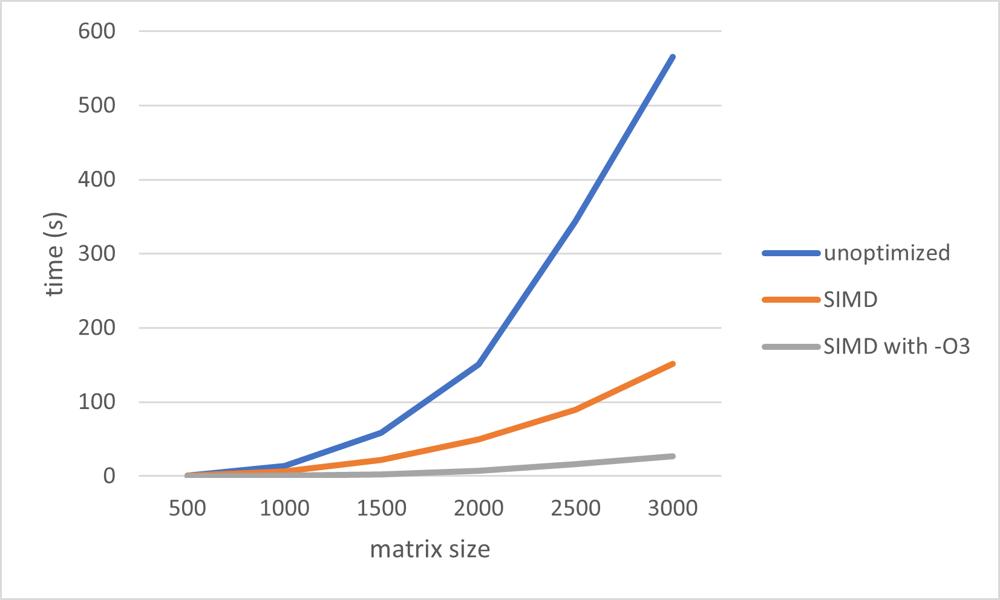
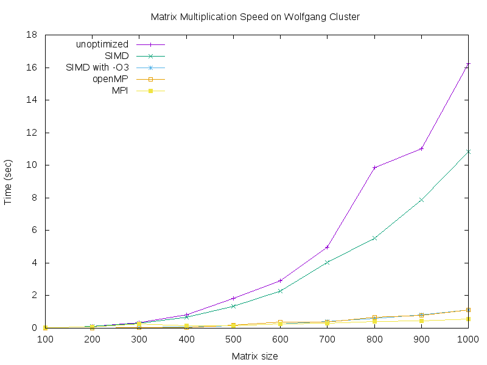

# matrix-02-zhou-chen-schaller
matrix-02-zhou-chen-schaller created by GitHub Classroom

## Distributed Parallel Computing
SIMD, OMP, and MPI are different types of parallel computing that utilize different methods in order to achieve parallel processing.

### What is SIMD?
SIMD (Single Instruction Multiple Data) refers to a type of parallel computing in a single instruction is capable of processing multiple data streams simultaneously. SIMD-based programming is also commonly known as vectorization, in which vectorized data is stored in blocks, meaning that multiple values can be loaded at once. The advantage of this type of parallel computing is that a single instruction can be executed on multiple data points as opposed to having to execute multiple instructions for each individual data point, thus improving performance.

### What is OMP?
OMP (OpenMP) is an API that supports multi-platform shared-memory multiprocessing programming. OpenMP utilizes symmetric multiprocessing, and uses parallel regions, which are blocks of code that are executed by all local threads simultaneously. The OMP programming model is SMP (shared-memory processors), which means that all threads share memory and data when programming with OMP. The aforementioned parallel regions are marked to run simultaneously, for which threads are formed that each individually execute the parallelized section of the code before joining the master thread. OMP works with C, C++, and Fortran and is supported by standard compilers. It also allows the programmer to specify the parallel regions, how to parallel loops, the scope of the variables in the parallel section (private and shared), if the threads are to be synchronized, and how the work is divided between threads (scheduling).

### What is MPI?
MPI (Message Passing Interface) a standardized message-passing system used to communicate between several computers that are separate but linked, also referred to as a cluster. This implements the distributed memory type of parallel computing, and the standard defines the syntax and semantics for a set of API declarations, such as send, receive, broadcast for message-passing, as well as their expected behaviors. MPI was designed for high performance on massively parallel machines and on workstation clusters, and is widely available for free and in vendor-supplied implementations.

### Our Solution
We created four separate files (mmult, mmult_simd, mmult_omp, mmult_mpi) that define matrix multiplication functions using the different parallel computing approaches explained above. Our main program (`make mmult_main`) implements a basic user command-line interface for testing and timing the running times of these different algorithms when multiplying random matrices of sizes (100, 200, 300, ..., 1000). It generates tabular data from timing in a respective .txt file using the following format:
```
100 0.005419
200 0.118126
300 0.329821
... ...
1000 16.249184
```
The data from the five text files mmult.txt, mmult_simd.txt, mmult_simd_O3.txt, mmult_openMP.txt, and mmult_mpi.txt are used by the automated graphing script graph.gnu that is run via command-line with `gnuplot graph.gnu`, outputting a multi-line plot to graph.png.

Our solution also includes the mmult_mpi_omp program for multiplication using both MPI to distribute the computation among nodes and OMP to distribute the computation among threads. The program, when run, takes two command line arguments as paths to .txt files holding two matrices to multiply. These text files should be in the following format:
```
5 5
0.0 9.7 9.7 0.6 2.7
3.1 8.7 5.2 7.7 0.6
5.4 4.7 9.1 2.6 4.0
4.5 0.1 7.9 4.7 3.2
6.5 8.7 2.4 6.1 6.2
```
The program then writes the result to c.txt and verifies that the result is correct by using the single-threaded matrix multiplication algorithm on the two matrices and comparing the results.





## Teamwork
We locked the master branch and pushed our work to branches so that we could review and approve each other's work before merging it into master. You can also find the contributions of each team member on our project board linked in the Project Life Cycle section.

### Ricky Zhou
* Week 1
  * Completed the first iteration of the main testing program, generating data in tabular format for graph production for the unoptimized mmult and SIMD mmult with and without -O3 optimization
* Week 2
  * Implemented OpenMP & MPI algorithms into main for testing and data generation
  * Modified mmult_mpi_omp.c to multiply matrices created from data from txt files provided via command line arguments, writing the resulting matrix to c.txt and verifying the result using single-threaded multiplication
  

### Darren Chen
* Week 1
  * Rewrote vectorized matrix multiplication algorithm to run with SIMD
  * Researched and wrote the section of the README explaining the differences between SIMD, OpenMP, and MPI
* Week 2
  * Wrote code for MPI multiplication
  * Modified mmult_mpi_omp.c to multiply matrices using both MPI to distribute the computation among nodes and OMP to distribute the computation among threads

### Karl Schaller
* Week 1
  * Tracked progress, keeping the Trello Board up to date and detailed for the week
  * Worked on the first iteration of the main testing program, running the unoptimized mmult and generating data
  * Created rough outline for README
  * Manually created the graph for unoptimized, SIMD, and SIMD with -O3 by entering data from text files into Excel
* Week 2
  * Tracked progress, keeping the Trello Board up to date and detailed for the week
  * Automated graph generation using gnuplot
  * Completed all writing in README (excluding additional tasks)

## Full Project Life Cycle
We used a [Trello Board](https://trello.com/b/20iU4Cqc/02-zhou-chen-schaller) to plan and manage our project and teamwork throughout the project life cycle. At the beginning of each week, we planned out the tasks we needed to accomplish, using checklists to break down the more complicated tasks and allocating tasks among team members.

Our general development cycle was to write code locally, and then upload it to the Wolfgang cluster to compile, run, and test, committing changes after ensuring that they ran correctly on the cluster by testing manually. We ensured the validity of our multiplication algorithms by comparing the results they produced with the results of the unoptimized single-threaded multiplication. The program that multiplies matrix data from two .txt files and writes the resulitng matrix in c.txt helped us manually check this. Our main program data collection combined with the graph visualization also acted as additional confirmation for our algorithms (we would expect each line to look like quadratic complexity, and we would expect our newer and more effective algorithms like MPI to perform significantly better).

We planned to utilize some of the provided functions from mat.h in our code (we used the gen_matrix(n, m) to generate random matrices of specific sizes), but this also turned out to be problematic at times. For example, when reading matrices from files for mmult_mpi_omp, we used the read_matrix_from_file(path) function as suggested, but found that the associated read_size_from_file(path) function was no longer provided in mat.c. We also ran into some problems in our initial main program trying to utilize mat.c's deltaTime(start, end) function. These problems were resolved by making some changes when compiling and in the MakeFile.

We also allocated time for generating graphs, and later automating this process during Week 2. In the end, our team likely spent around 2/3 of its time writing code for the matrix multiplication algorithms and 1/3 of its time running, testing, reporting, and preparing write-up materials.
