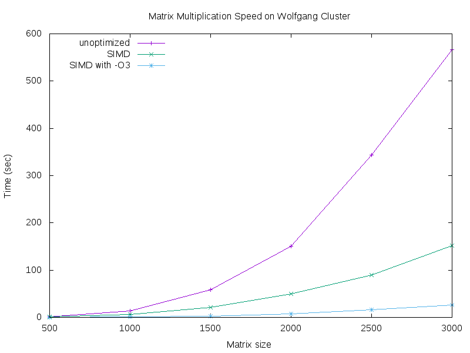

# matrix-02-zhou-chen-schaller
matrix-02-zhou-chen-schaller created by GitHub Classroom

## Distributed Parallel Computing

SIMD, OMP, and MPI are different types of parallel computing that utilize different methods in order to achieve parallel processing.

### What is SIMD?
SIMD (Single Instruction Multiple Data) refers to a type of parallel computing in a single instruction is capable of processing multiple data streams simultaneously. SIMD-based programming is also commonly known as vectorization, in which vectorized data is stored in blocks, meaning that multiple values can be loaded at once. The advantage of this type of parallel computing is that a single instruction can be executed on multiple data points as opposed to having to execute multiple instructions for each individual data point, thus improving performance.

### What is OMP?
OMP (OpenMP) is an API that supports multi-platform shared-memory multiprocessing programming. OpenMP utilizes symmetric multiprocessing, and uses parallel regions, which are blocks of code that are executed by all local threads simultaneously. The OMP programming model is SMP (shared-memory processors), which means that all threads share memory and data when programming with OMP. The aforementioned parallel regions are marked to run simultaneously, for which threads are formed that each individually execute the parallelized section of the code before joining the master thread. OMP works with C, C++, and Fortran and is supported by standard compilers. It also allows the programmer to specify the parallel regions, how to parallel loops, the scope of the variables in the parallel section (private and shared), if the threads are to be synchronized, and how the work is divided between threads (scheduling).

### What is MPI?
MPI (Message Passing Interface) a standardized message-passing system used to communicate between several computers that are separate but linked, also referred to as a cluster. This implements the distributed memory type of parallel computing, and the standard defines the syntax and semantics for a set of API declarations, such as send, receive, broadcast for message-passing, as well as their expected behaviors. MPI was designed for high performance on massively parallel machines and on workstation clusters, and is widely available for free and in vendor-supplied implementations.

### Our Solution
- SIMD functions by having each instruction perform the same operation on multiple vectors of data simultaneously in order to achieve parallel computing.
- OpenMP utilizes symmetric multiprocessing, in which multiple processors share common memory as well as I/O resources via an API that supports the necessary level of multi-platform shared-memory multiprocessing programming.
- MPI uses distributed memory, in which independent computers are linked via a high-speed network (or cluster), and information is shared via a standardized message-passing system.
* Explain the architecture of your solution.
* Explain the variations of algorithm you implemented.

## Teamwork

We locked the master branch and pushed our work to branches so that we could review and approve each other's work before merging it into master. You can also find the contributions of each team member on our project board linked in the Project Life Cycle section.

### Ricky Zhou
* Week 1
  * Completed the first iteration of the main testing program, generating data in tabular format for graph production for the unoptimized mmult and SIMD mmult with and without -O3 optimization
* Week 2
  * Implemented OpenMP & MPI algorithms into main for testing and data generation
  * Modified mmult_mpi_omp.c to multiply matrices created from data from txt files provided via command line arguments, writing the resulting matrix to c.txt and verifying the result using single-threaded multiplication
  

### Darren Chen
* Week 1
  * Rewrote vectorized matrix multiplication algorithm to run with SIMD
  * Researched and wrote the section of the README explaining the differences between SIMD, OpenMP, and MPI
* Week 2
  * Wrote code for MPI multiplication
  * Modified mmult_mpi_omp.c to multiply matrices created from data from txt files provided via command line arguments, writing the resulting matrix to c.txt and verifying the result using single-threaded multiplication

### Karl Schaller
* Week 1
  * Tracked progress, keeping the Trello Board up to date and detailed for the week
  * Worked on the first iteration of the main testing program, running the unoptimized mmult and generating data
  * Created rough outline for README
  * Manually created the graph for unoptimized, SIMD, and SIMD with -O3 by entering data from text files into Excel
* Week 2
  * Tracked progress, keeping the Trello Board up to date and detailed for the week
  * Automated graph generation using gnuplot
  * Completed all writing in README (excluding additional tasks)

## Full Project Life Cycle

We used a [Trello Board](https://trello.com/b/20iU4Cqc/02-zhou-chen-schaller) to plan and manage our project and teamwork throughout the project life cycle. At the beginning of each week, we planned out the tasks we needed to accomplish, using checklists to break down the more complicated tasks and allocating tasks among team members.

* Is the usual cycle: write code, compile code,  run code, test code was the same when doing remote development on Wolfgand cluster. Did you need to adapt your way of working or use different tools?
* What kind of testing did you plan to use for this project? Did you consider measuring speed, memory consumption and validity of results for matrix multiplication. Did you consider that the code provided by the professor could have flaws?
* Did you need to write code or use tools to generate random matrix of specific sizes? Did you put this in your plan? 
* Did you put in your plan the work needed to generate tables or graphs? Did you automate this work?  
* What proportion of the tasks (and time) in your plan is  about writing variations on the matrix multiplication algorithm and what proportion is about testing and reporting activities?
* Include all tables, graphs and explanations needed to understand your work in the README.md file. No new or supplemental information should need to be communicated during the demo to grade your work.  
